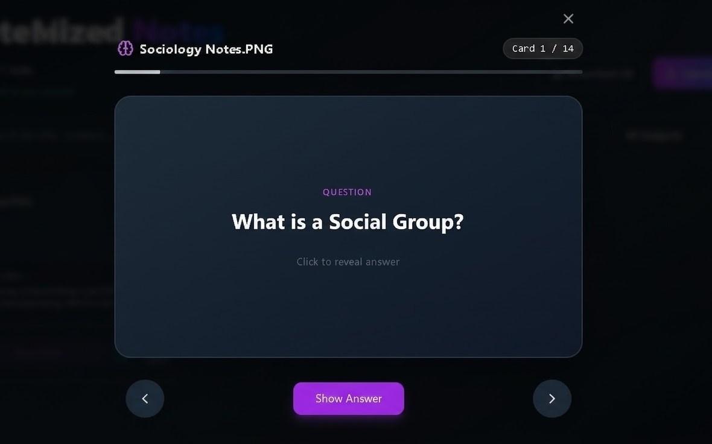

NoteMap — AI-Powered Study Tool
NoteMap is a serverless, AI-powered platform designed to transform raw study materials into structured academic assets. By leveraging advanced OCR and Large Language Models, NoteMap automates the creation of organized study notes and interactive flashcards from PDF and image uploads.

🚀 Key Features
Intelligent OCR Processing: Utilizes a hybrid extraction strategy with pdf.js and Tesseract.js for local processing, alongside a Python backend capable of advanced deskewing, denoising, and multi-PSM OCR for complex or handwritten documents.

AI-Driven Content Analysis: Uses Amazon Bedrock to parse raw text into structured JSON, automatically identifying key sections, core concepts, and subject classifications.

Automated Flashcard Generation: Instantly creates study-ready flashcards from extracted concepts to facilitate active recall.

Responsive Dashboard: A modern, user-friendly interface featuring dark/light mode, real-time upload progress tracking, and subject-based filtering.

Dynamic Exporting: Export your processed notes into multiple formats, including professionally formatted PDFs (via jsPDF), TXT, and Word documents.

Secure Cloud Storage: Integration with AWS Cognito for authentication and S3 for secure file management.

📸 Project Walkthrough
Home Page
The gateway to NoteMap, highlighting the tool's core value proposition and seamless login experience.

Upload Page
Supports drag-and-drop for PDFs and images. Features real-time status updates and pre-processing visualization.

Dashboard Page
A centralized hub for all processed notes, categorized by subject with a hierarchical table of contents (TOC).

Interactive Flashcards
Engage with AI-generated flashcards to test your knowledge directly within the app.

🛠️ Tech Stack
Frontend
Framework: React.js

Styling: Tailwind CSS (for responsive UI and Dark/Light modes)

Authentication & API: AWS Amplify, Cognito

PDF/Image Processing: pdf.js, Tesseract.js, jsPDF

Backend & AI
Serverless Architecture: AWS Lambda, API Gateway

Database: Amazon DynamoDB (NoSQL for scalable note storage)

Storage: Amazon S3 (Secure document hosting)

AI/LLM: Amazon Bedrock (Parsing and structured data generation)

Python NLP Stack: Flask, spaCy, NLTK, KeyBERT, and OpenCV
